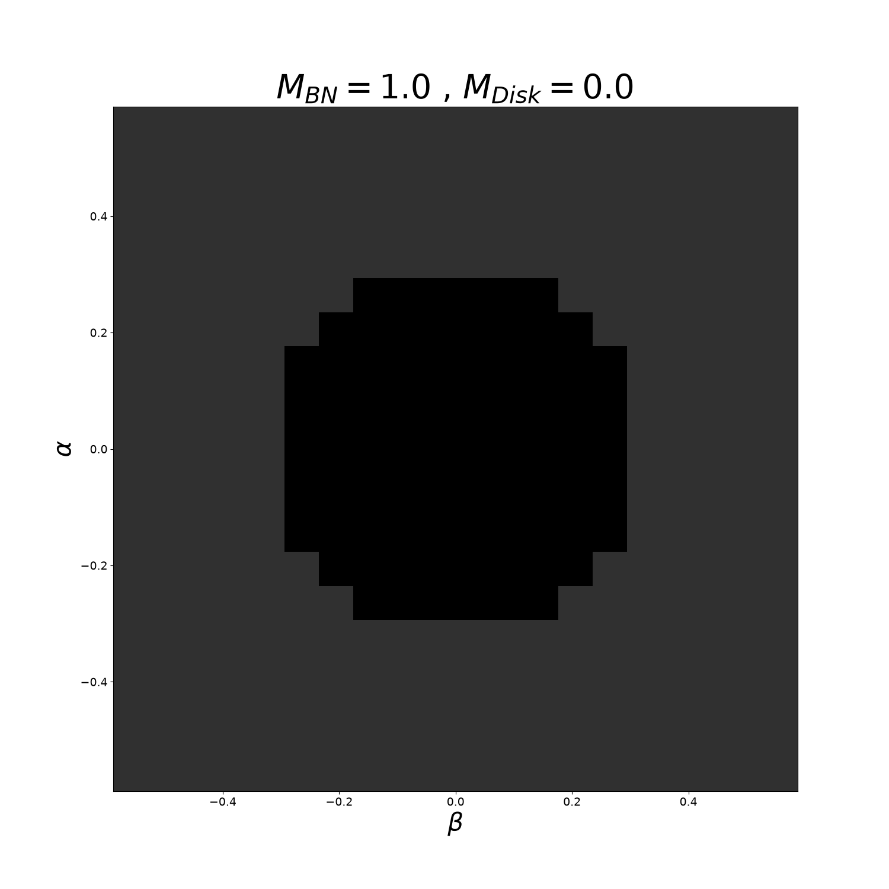

# Test Results

A log of end-to-end pipeline runs performed from the `test_runs/` orchestrators.
Each entry records the physical scenario, the parameters used, and the resulting
image so a run can be reproduced and its output inspected without re-executing it.

---

## Run 1 — Schwarzschild black hole (no accretion disk)

**Scenario:** shadow of a Schwarzschild black hole in Weyl coordinates, with
**no accretion disk** — a pure vacuum spacetime (`MD = 0`). The output is the
characteristic solid dark shadow disk against the lighter escaped-ray
background, with none of the disk-crossing ring structure.

**Orchestrator:**
[`generate_Schwarzschild_no_disk/test_run_schwarzschild.py`](generate_Schwarzschild_no_disk/test_run_schwarzschild.py)

### Parameters

| Parameter | Value | Meaning |
|-----------|-------|---------|
| `M`         | `1.0`   | Black-hole mass |
| `MD`        | `0.0`   | Disk mass — zero, i.e. pure Schwarzschild vacuum |
| `b`         | `6.0`   | Disk radius (unused for classification when `use_disk=False`) |
| `USE_DISK`  | `False` | Disables the disk-crossing branch and the beyond-disk classification, giving a pure BH-shadow render |
| lambda-matrix grid | `n = 200` (200×200) | Resolution of the `lambda(rho, z)` lookup table over `rho ∈ [0, 40]`, `z ∈ [-40, 40]`. Exact for `MD=0` since lambda has a closed form there, so a coarse grid stays accurate. |
| shadow grid | `N_POINTS = 20` | Emission-angle grid resolution before quadrant-halving (traced quarter is 10×10; the mirrored full image is 20×20). A small/fast sanity resolution, not publication quality. |

### Pipeline stages

1. **`generate_matriz.generate_lambda_matrix`** — tabulate the lambda-potential
   lookup table (200×200), saved to `test_run_schwarzschild_matrices/`.
2. **`test_Z_SHADOW.trace_shadow`** (with `use_disk=False`) — ray-trace the
   quarter-image shadow grid serially; the disk-crossing branch is disabled, so
   rays are only classified as escaped or captured.
3. **`symmetry.render_shadow`** (with `use_disk=False`) — classify
   captured/neither, mirror the quadrant into the full image, and save the PNG.

### Result

A clean Schwarzschild shadow: a single dark central disk with **no** surrounding
disk ring, confirming the `use_disk=False` path produces the intended
pure-vacuum shadow.



> Reproduce with:
> ```
> cd test_runs/generate_Schwarzschild_no_disk
> uv run python test_run_schwarzschild.py
> ```

See `claude_interaction_steps.md` (Interaction 9) for the implementation details
behind the `use_disk` toggle.
